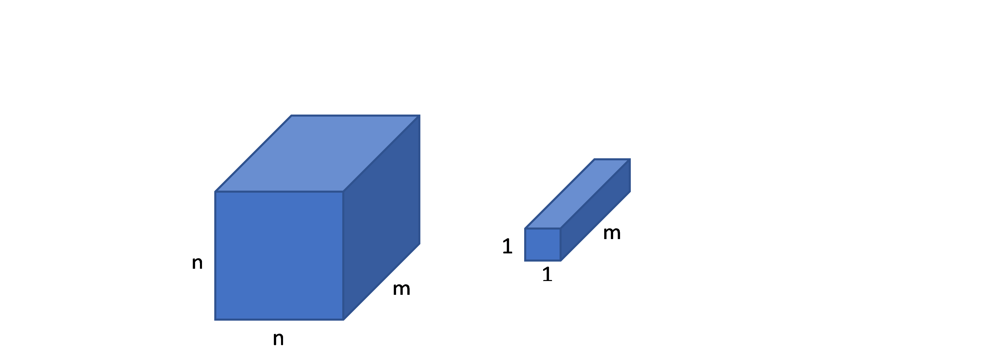
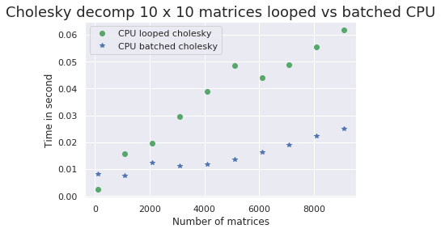
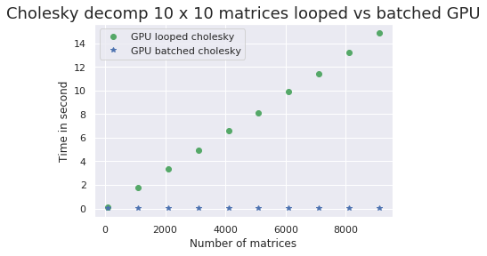
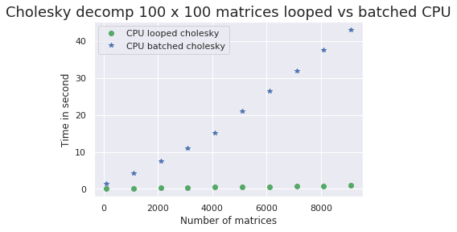
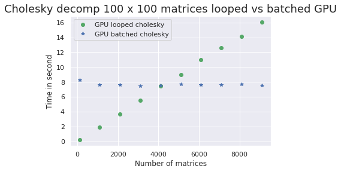
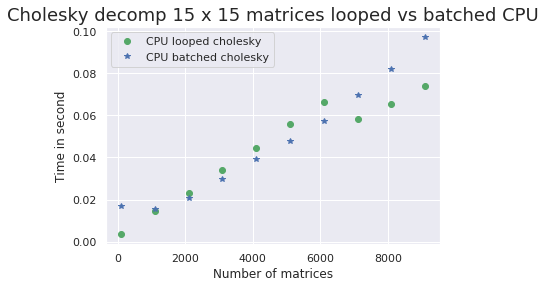
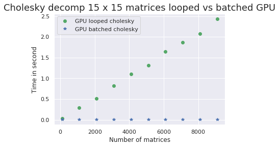
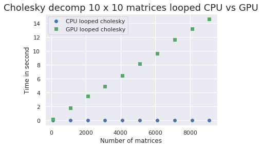
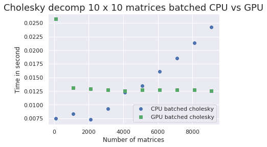
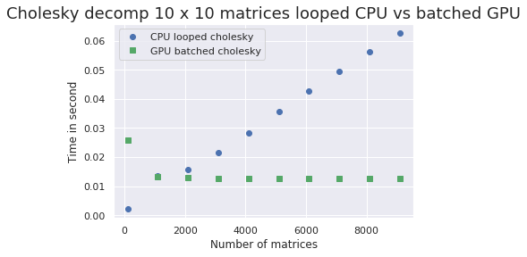

# <p align="center">Scientific Computing with PyTorch<br> A Quantum Mechanics Example</p>
##<p align="center">Dr. Donald B Kinghorn<br> [Puget Systems](https://www.pugetsystems.com)


###<p align="center">A Quantum Mechanics problem coded up in PyTorch?! Sure! Why not?

---

## Reference Blog Posts @ [https://www.pugetsystems.com/all_hpc.php](https://www.pugetsystems.com/all_hpc.php)

* #### [Doing Quantum Mechanics with a Machine Learning Framework: PyTorch and Correlated Gaussian Wavefunctions: Part 1) Introduction](https://www.pugetsystems.com/labs/hpc/Doing-Quantum-Mechanics-with-a-Machine-Learning-Framework-PyTorch-and-Correlated-Gaussian-Wavefunctions-Part-1-Introduction-1207/)
* #### [PyTorch for Scientific Computing - Quantum Mechanics Example Part 2) Program Before Code Optimizations](https://www.pugetsystems.com/labs/hpc/PyTorch-for-Scientific-Computing---Quantum-Mechanics-Example-Part-2-Program-Before-Code-Optimizations-1222/)
* #### [PyTorch for Scientific Computing - Quantum Mechanics Example Part 3) Code Optimizations - Batched Matrix Operations, Cholesky Decomposition and Inverse](https://www.pugetsystems.com/labs/hpc/PyTorch-for-Scientific-Computing---Quantum-Mechanics-Example-Part-3-Code-Optimizations---Batched-Matrix-Operations-Cholesky-Decomposition-and-Inverse-1225/)
* #### [PyTorch for Scientific Computing - Quantum Mechanics Example Part 4) Full Code Optimizations -- 16000 times faster on a Titan V GPU](https://www.pugetsystems.com/labs/hpc/PyTorch-for-Scientific-Computing---Quantum-Mechanics-Example-Part-4-Full-Code-Optimizations----16000-times-faster-on-a-Titan-V-GPU-1230/)


* ##### New to Pytorch?  [Why You Should Consider PyTorch (includes Install and a few examples)](https://www.pugetsystems.com/labs/hpc/Why-You-Should-Consider-PyTorch-includes-Install-and-a-few-examples-1193/)

---

>My problem of interest is a "simple" Quantum Mechanics eigen-function partial differential equation for few particle systems utilizing a wave-function expansion with "correlated Gaussian basis functions". **It's a relatively simple problem really, and we can code the whole thing up a in couple hundred lines of Python using PyTorch.**

---

##Why PyTorch?

* PyTorch is compatible with Numpy and has equivalents for most of it's routines
* Switching between CPU and CUDA on GPU is seamless and very simple.
* Automatic differentiation is well implemented and relatively easy to use
* PyTorch contains a rich set of both CPU and CUDA based BLAS (Basic Linear Algebra Subroutines) and Lapack (higher level linear algebra algorithms).
* It has "batched" routines to extend matrix operation to larger Tensors structures.
* It's interactive and easy to use in a Jupyter notebook!

---

## The Quantum Mechanics

Here is your brief introduction to doing quantum mechanics of few particle systems from "first principles".

We want to solve the Schrodinger equation,
$$
H\Psi = E\Psi
$$
$H$ is the Hamiltonian energy operator, $E$ is an energy eigenvalue and $\Psi$ is an eigenfunction of $H$, the "wavefunction" of the system.

---
Notes:
 The Schrodinger equation is separable into time-dependent and time-independent parts. We look at the time-independent part that governs the internal states of a system.

 We use natural "au" units,
 * $\hbar = 1$
 * Mass of electron = 1
 * electron charge is -1
 * Energy is in units of "hartrees"

Our model system is a collection of non-relativistic particles with given masses and charges interacting under a coulomb potential with no external fields.

---

 You can turn the problem into a numerical partial differential equation (Matrix eigenvalue problem) by expanding $\Psi$ in a "basis set" of appropriate functions.

  $$
  \Psi = \sum_k c_k \phi_k(A_k;r)
  $$

---

### The Hamiltonian Operator
   "internal" coordinates after removing translational energy of center of mass (3 degrees of freedom), an exact transformation.

$H$ is the sum of kinetic $T$ and potential $V$ energy operators,

$$
H = -\frac 12\left( \sum_i^n\frac 1{\mu_i}\nabla_i^2+\sum_{i,j}^n\frac
1{M_1}\nabla_i\cdot \nabla_j\right) + \sum_i^n\frac {q_0q_i}{r_i} + \sum_i^n \sum_{i<j} \frac {q_iq_j}{r_{ij}}
$$


* $\{M_1,\cdots ,M_p\}$ are particle masses
* $\mu_i=M_1M_i/\left( M_1+M_i\right) $ are the reduced masses
* $q_i$ are the particle charges
* $r_{ij}=\left\| r_i-r_j\right\| $
* $r_i$ is the Cartesian coordinate vector for particle $i$
* $\nabla_i$ is the gradient operator with respect to the $x,y,z$ coordinates of particle $i$

---

### The Basis Set (correlated Gaussians)

$$
\begin{eqnarray}
\phi_k &=&\exp \left[ -r^{\prime }\left( L_kL_k^{\prime }\otimes I_3\right)
r\right]
&=&\exp \left[ -r^{\prime }\left( A_k\otimes I_3\right) r\right]
&=&\exp \left[ -r^{\prime }\bar{A}_kr\right]
\end{eqnarray}
$$

* $r$ is a $3n \times 1$ vector of Cartesian coordinates for the $n$ particles
* $L_k$ is an $n\times n$ rank $n$ lower triangular matrix
* $A_k=L_kL_k^{\prime }$ is written in this Cholesky factored form
* $\exp \left[ -r^{\prime
}\left( A_k\otimes I_3\right) r\right] =\exp \left[
-\sum_{i,j}a_{ij}r_i\cdot r_j\right] $
* $r_{ij}^2=r_i\cdot r_i+r_j\cdot r_j-2r_i\cdot r_j$

The Kronecker product with the $3\times 3$ identity matrix $I_3$ insures rotational invariance

---

### Symmetry
There is one more detail, permutational symmetry and "spin".

The Hamiltonian operator is invariant to interchange of like particles.

One of the defining aspects of quantum mechanics is the symmetry of the wavefunction that is induced by spin angular momentum (particularly the half integral spin of electrons).

It is consideration of the symmetry aspects of the system that defines the valid "particular solutions" to the Schrodinger equation.

We need a proper symmetry projection operator to get the wavefunction we are looking for.

We are looking is close to "pure" quantum mechanics with very few approximations

---

The end result of the discussion above is that we need to find "matrix elements" for $H$ and for the "overlap" $S$ and then minimize the smallest eigenvalue of the generalized  eigenvalue equation $(H-ES)c = 0$. $H$ and $S$ are matrices of integrals like,
$$
H_{kl} = \langle\phi_k|H|\phi_l\rangle = \int^\infty_{-\infty} \phi^\star_k H \phi_l dr
$$

$$
S_{kl} = \langle\phi_k|\phi_l\rangle = \int^\infty_{-\infty} \phi^\star_k  \phi_l dr
$$

$\langle\phi_k|H|\phi_l\rangle$ is a probabilistic "expectation value" for the operator $H$

---

**You know the fundamentals of "doing" quantum mechanics. Congratulations!**

Now on to the formulas and code ...

---

## The formulas that need to be coded up
We need to find the integral formulas for $H$ and $S$ over those basis functions

---

### Overlap $S$
$$
S_{kl}= 2^{3n/2}\left( \frac{\left\|
L_k\right\| \left\| L_l\right\| }{\left| A_{kl}\right| }\right) ^{3/2}
$$
$L_k$ and $L_l$ are lower triangular matrices of of (independent variable) parameters that will be optimized. $A_{kl} = A_k + \tau_P^{\prime }A_l\tau_P$ with $\tau$ a symmetry projection matrix. $|A|$ means determinate.

---

### Kinetic energy $T$
$$
T_{kl}=6S_{kl}\,\mathrm{tr}\left[ MA_kA_{kl}^{-1}\tau_P^{\prime }A_l\tau_P\right]
$$

$M$ is a matrix of reduced mass constants.

---

### Potential energy $V$
$$
V_{kl}=\frac 2{\sqrt{\pi }}S_{kl}\, \sum_{i>j}Q*R_{ij}
$$

$Q$ is a lower triangular matrix of "charge products" and $R_{ij}$ is a lower triangular matrix constructed from elements in $A_{kl}^{-1}$
$$
R_{ij}=\,\mathrm{\,\,} \,\left(
\left\{
\begin{array}{ll}
\left[A_{kl}^{-1}\right]_{ii}^{-1/2} & i=j \\
\left(\left[A_{kl}^{-1}\right]_{ii}+\left[A_{kl}^{-1}\right]_{jj} -2\left[A_{kl}^{-1}\right]  \right)^{-1/2} & i>j
\end{array}
\right. \right)
$$
<!-- _{ij}  I yanked this out of the formula above -->

---

## Important Point!
**Those are very compact matrix equations for what are really quite elaborate integrals derived with matrix calculus.** If those formulas were written out with summation signs instead of matrix formulas there would be several pages of ugly formulas to consider.

**Having formulas in matrix form is a big plus for code implementation.**

---

### Energy function
For the energy (loss) function we use the "Rayleigh quotient",

$$
E = \min_c\left(\frac{c'Hc}{c'Sc} \right)  
$$

The minimum over $c$ of the Rayleigh quotient is the smallest eigenvalue and that minimal $c$ is the corresponding eigenvector.

By doing this we can optimize the linear expansion coefficients in $c$ simultaneously with the non-linear parameters that are contained in the matrices $L_k$.

---

The independent parameter variables for our energy (loss) function $E$ is the collection of all of the lower triangular elements of the $L_k$ matrices for all of the basis functions along with  the vector of expansion coefficients $c$. Those optimization parameters will be placed in a vector x. That will give $E$ as a function of x that will return the energy and gradient at the value of x. We will minimize that.

**Got it? Let's code it up!**

---
## First "naive" implementation of the code in PyTorch

This is a completely reasonable implementation of the equations. It was translated from my old MATLAB testing code. It is almost directly going from matrix-math to matrix-code.


>**The first thing to do is get working code!**

(there is test code in the blog post "part 2" )

---

#### Import PyTorch
```
import torch as th # PyTorch is imported as torch and will be referenced as "th"

import time
```
#### Setup compute device and data-type
We will use the CPU until we do the code optimizations. (The code as-is will run on the GPU but performance is bad.)
```
dtype = th.float64

gpuid = 0
#device = th.device("cuda:"+ str(gpuid))
device = th.device("cpu")

print("Execution device: ",device)
print("PyTorch version: ", th.__version__ )
print("CUDA available: ", th.cuda.is_available())
print("CUDA version: ", th.version.cuda)
print("CUDA device:", th.cuda.get_device_name(gpuid))
```
```
Execution device:  cpu
PyTorch version:  0.4.1
CUDA available:  True
CUDA version:  9.0.176
CUDA device: TITAN V
```
#### Utility functions
```
# Utility functions for working with lower triangular matrices

# return the lower triangle of A in column order i.e. vech(A)
def vech(A):
    count = 0
    c = A.shape[0]
    v = th.zeros(c * (c + 1) // 2, device=device, dtype=dtype)
    for j in range(c):
        for i in range(j,c):
            v[count] = A[i,j]
            count += 1
    return v

# vech2L   create lower triangular matrix L from vechA
def vech2L(v,n):
    count = 0
    L = th.zeros((n,n), device=device, dtype=dtype)
    for j in range(n):
        for i in range(j,n):
            L[i,j]=v[count]
            count += 1
    return L
```
#### Compute formulas for "matrix elements"

```
def matrix_elements(n, vechLk, vechLl, Sym, Mass, vecQ):
    '''
    Returns: a dictionary with the skl, tkl, vkl matrix elements
    n : the size of the Lk matrices
    vechL(k,l): vector of parameters use for Lk and Ll matrices
    Sym: a single symmetry projection matrix
    Mass: a matrix of "reduced mass" values for the particles needed for tkl
    vecQ: an array of products of particle charges needed for vkl   
    '''
    # build Lk and Ll

    Lk = vech2L(vechLk,n);
    Ll = vech2L(vechLl,n);

    # apply symmetry projection on Ll

    # th.t() is shorthand for th.transpose(X, 0,1)
    PLl = th.t(Sym) @ Ll;

    # build Ak, Al, Akl, invAkl

    Ak = Lk@th.t(Lk);
    Al = PLl@th.t(PLl);
    Akl = Ak+Al
    invAkl = th.inverse(Akl);

    # Overlap (normalized)
    skl = 2**(3*n/2) * th.sqrt( th.pow(th.abs(th.det(Lk))*th.abs(th.det(Ll))/th.det(Akl) ,3) );

    # Kinetic energy

    tkl = skl*(6*th.trace(Mass@Ak@invAkl@Al));

    # potential energy

    TWOoSqrtPI = 1.1283791670955126 # 2/sqrt(pi)

    RIJ = th.zeros((n,n), device=device, dtype=dtype);
    # 1/rij i~=j
    for j in range(0,n-1):
        for i in range(j+1,n):
            tmp2 = invAkl[i,i] + invAkl[j,j] - 2*invAkl[i,j];
            #RIJ[i,j] = TWOoSqrtPI * skl/th.sqrt(tmp2);
            RIJ[i,j] = 1/th.sqrt(tmp2)

    # 1/rij i=j
    for i in range(0,n):
        #RIJ[i,i] = TWOoSqrtPI * skl/th.sqrt(invAkl[i,i]);
        RIJ[i,i] = 1/th.sqrt(invAkl[i,i])

    RIJ = TWOoSqrtPI*skl*RIJ    
    Q = vech2L(vecQ,n);

    vkl = th.sum(RIJ*Q)

    return {'skl':skl, 'tkl':tkl, 'vkl':vkl}
```
You can see how close the PyTorch/Python code is to the mathematical matrix formulas. This makes it very quick to get working code running.


#### Define the energy "loss" function
"energy()" loops over the lower triangle of S T and V making calls to the matrix element code. These matrices are then used to create the Hamiltonian matrix H and Overlap S that are then used to compute the energy.
```
def energy(x,n,nb,Mass,Charge,Sym,symc):
    '''
    Returns: the energy at the point (parameters) x
    n: number of particles defined in input
    nb: number of basis functions
    Mass: matrix of "reduced" mass constants for system
    Charge: vector of "charge products" for particle pairs
    Sym: a tensor containing the symmetry projection matrices
    symc: a vector of coefficients for the symmetry projection terms
    '''

    nx = len(x);
    nn = int(n*(n+1)/2);
    nsym = len(symc);

    # extract linear coefs "eigen vector" from x
    c = x[-nb:];
    # reshape non-linear variables for easier indexing
    X = th.reshape(x[:nb*nn], (nb,nn))

    # Init H S T V
    H = th.zeros((nb,nb), device=device, dtype=dtype);
    S = th.zeros((nb,nb), device=device, dtype=dtype);
    T = th.zeros((nb,nb), device=device, dtype=dtype);
    V = th.zeros((nb,nb), device=device, dtype=dtype);

    # outer loop is over symmetry terms
    for k in range(0,nsym):

        for j in range(0,nb):
            for i in range(j,nb):

                vechLi = X[i,:]
                vechLj = X[j,:]

                matels = matrix_elements(n,vechLi,vechLj,Sym[:,:,k],Mass,Charge);

                S[i,j] += symc[k]*matels['skl'];
                T[i,j] += symc[k]*matels['tkl'];
                V[i,j] += symc[k]*matels['vkl'];

    H = T + V

    # complete upper triangle of H and S
    for i in range(0,nb):
        for j in range(i+1,nb):
            H[i,j] = H[j,i];
            S[i,j] = S[j,i];

    # The energy from the Rayleigh quotient

    cHc = c@H@c;
    cSc = c@S@c;
    eng = cHc/cSc;

    return eng
```

---

#### Test the energy
The following function defines the constants for Li atom (infinite nuclear mass). There is sample input for an 8 term wavefunction with the non-linear parameters in x1.   
```
def test_energy():

    Mass = th.tensor([[0.5, 0.0, 0.0],
                     [0.0, 0.5, 0.0],
                     [0.0, 0.0, 0.5]], device=device, dtype=dtype);

    Charge = th.tensor([-3, 1, 1, -3, 1, -3], device=device, dtype=dtype);

    # symmetry projection terms
    Sym = th.zeros((3,3,6), device=device, dtype=dtype)
    # (1)(2)(3)
    Sym[:,:,0] = th.tensor([[1,0,0],[0,1,0],[0,0,1]], device=device, dtype=dtype);
    # (12)
    Sym[:,:,1] = th.tensor([[0,1,0],[1,0,0],[0,0,1]], device=device, dtype=dtype);
    # (13)
    Sym[:,:,2] = th.tensor([[0,0,1],[0,1,0],[1,0,0]], device=device, dtype=dtype);
    # (23)
    Sym[:,:,3] = th.tensor([[1,0,0],[0,0,1],[0,1,0]], device=device, dtype=dtype);
    # (123)
    Sym[:,:,4] = th.tensor([[0,1,0],[0,0,1],[1,0,0]], device=device, dtype=dtype);
    # (132)
    Sym[:,:,5] = th.tensor([[0,0,1],[1,0,0],[0,1,0]], device=device, dtype=dtype);

    # coeff's
    symc = th.tensor([4.0,4.0,-2.0,-2.0,-2.0,-2.0], device=device, dtype=dtype);

    n=3;
    nb=8;

    xvechL=th.tensor([
         1.6210e+00, -2.1504e-01,  9.0755e-01,  9.7866e-01, -2.8418e-01,
        -3.5286e+00, -3.3045e+00, -4.5036e+00, -3.2116e-01, -7.1901e-02,
         1.5167e+00, -8.4489e-01, -2.1377e-01, -3.6127e-03, -5.3774e-03,
        -2.1263e+00, -2.5191e-01,  2.1235e+00, -2.1396e-01, -1.4084e-03,
        -1.0092e-02,  4.5349e+00,  9.4837e-03,  1.1225e+00, -2.1315e-01,
         5.8451e-02, -4.9410e-03,  5.0853e+00,  7.3332e-01,  5.0672e+00,
        -2.1589e-01, -6.8986e-03, -1.4310e-02,  1.5979e+00,  3.3946e-02,
        -8.7965e-01, -1.1121e+00, -2.1903e-03, -4.6925e-02,  2.1457e-01,
         3.3045e-03,  4.5120e+00, -2.1423e-01, -1.6493e-02, -2.3429e-03,
        -8.6715e-01, -6.7070e-02,  1.5998e+00
     ], device=device, dtype=dtype, requires_grad=False)

    evec = th.tensor([
      -6.0460e-02,  7.7708e-05, 1.6152e+00,  9.5443e-01,  
      1.1771e-01,  3.2196e+00,  9.6344e-01, 3.1398e+00
    ], device=device, dtype=dtype, requires_grad=False)

    # join the parameters into x1
    x1 = th.tensor(th.cat((xvechL,evec)), device=device, dtype=dtype, requires_grad=True)

    eng = energy(x1,n,nb,Mass,Charge,Sym,symc)
    print(eng) # Should return -7.3615 at this point x1
    return x1
```
```
start_time = time.time()
xrestart = test_energy()
print(" took {} seconds ".format(time.time() - start_time))
```
```
tensor(-7.3615, dtype=torch.float64, grad_fn=<DivBackward1>)
 took 0.11813998222351074 seconds
```
With those values of the parameters for x1 the the energy is as expected. Note the "requires_grad=True" attribute for x1. That tells PyTorch to keep track of those parameters for computing gradients.

---

#### Optimize energy using PyTorch Autograd gradients
```
def opt_energy(steps=1, num_basis=8):

    ############################################################################
    # Input constants for Li atom (infinite nuclear mass) Using B.O. approx.
    # in order to compare with other calculations. You can use actual isotopic
    # mass values for Li here. Mass would then have off-diag terms. See reduced
    # mass derivation.
    ############################################################################
    Mass = th.tensor([[0.5, 0.0, 0.0],
                     [0.0, 0.5, 0.0],
                     [0.0, 0.0, 0.5]], device=device, dtype=dtype);

    Charge = th.tensor([-3, 1, 1, -3, 1, -3], device=device, dtype=dtype);

    # symmetry projection terms
    Sym = th.zeros((3,3,6), device=device, dtype=dtype)
    # (1)(2)(3)
    Sym[:,:,0] = th.tensor([[1,0,0],[0,1,0],[0,0,1]], device=device, dtype=dtype);
    # (12)
    Sym[:,:,1] = th.tensor([[0,1,0],[1,0,0],[0,0,1]], device=device, dtype=dtype);
    # (13)
    Sym[:,:,2] = th.tensor([[0,0,1],[0,1,0],[1,0,0]], device=device, dtype=dtype);
    # (23)
    Sym[:,:,3] = th.tensor([[1,0,0],[0,0,1],[0,1,0]], device=device, dtype=dtype);
    # (123)
    Sym[:,:,4] = th.tensor([[0,1,0],[0,0,1],[1,0,0]], device=device, dtype=dtype);
    # (132)
    Sym[:,:,5] = th.tensor([[0,0,1],[1,0,0],[0,1,0]], device=device, dtype=dtype);

    # coeff's
    symc = th.tensor([4.0,4.0,-2.0,-2.0,-2.0,-2.0], device=device, dtype=dtype);
    ############################################################################


    n=3
    nb=num_basis
    th.manual_seed(3)
    x1 = th.empty(int(nb*n*(n+1)/2 + nb), device=device, dtype=dtype, requires_grad=True)
    th.nn.init.uniform_(x1, a=-.8, b=.8)    

    #x1 = xrestart

    optimizer = th.optim.Rprop([x1], lr=0.001, etas=(0.5, 1.2), step_sizes=(1e-06, 50))

    for i in range(steps):
        optimizer.zero_grad()
        loss = energy(x1,n,nb,Mass,Charge,Sym,symc)
        loss.backward()      
        optimizer.step()

        if (i<10 or not i%10):print('step: {:5}  f: {:4.12f}  gradNorm: {:.9f}'.format(i, loss, th.norm(x1.grad)))
    print('step: {:5}  f: {:4.12f}  gradNorm: {:.9f}'.format(i, loss, th.norm(x1.grad)))
    return x1
```
 The gradient for the optimization is evaluated by "back propagation" in the statement loss.backward(). I used the name loss in honor of standard Machine Learning name for the function being minimized.

I experimented with some of the machine learning optimization routines in PyTorch and found that "Rprop" worked really well for this problem. I used the a utility from the neural network module "nn" for the random parameter initialization. It was great having these kinds of tools in the framework for experimenting with!

You can run this code and it will optimize a wavefunction for the Li atom ground state energy. It will be converging toward a value of -7.478060 Hartrees' (an energy unit typically used in quantum chemistry). Running this for 100 "epochs" i.e. optimization steps gives the following output.

```
start_time = time.time()
xrestart = opt_energy(steps=100, num_basis=8)
print(" took {} seconds ".format(time.time() - start_time))
```

The next run is for a wavefunction with 512 basis terms. This is one step of the optimization which will give us a time for one energy and gradient evaluation. (this is from a random start point)
```
start_time = time.time()
xrestart = opt_energy(steps=1, num_basis=512)
print(" took {} seconds ".format(time.time() - start_time))
```
```
step:     0  f: -0.720436686340  gradNorm: 4.060212842
 took 2768.9312148094177 seconds
```
2768 seconds for one step is too long!

---

# Interlude
##Constant time scaling on GPU!
### tensor algorithms and batched operations are your friend on GPU

This stuff is from "part 3" of the blog posts

---

## Batched Cholesky Decomposition in PyTorch

This is the most important concept in these slides.

Lets say you have many, $n \times n$ matrices, $m$ of them. You want to do an algorithm that acts on the individual elements of those matrices i.e. like a Cholesky decomposition and maybe find determinants and inverses. For a data structure to hold these matrices you can use an $ m \times n \times n$ tensor. You can visualize that like this,



Think of that as a stack of matrices. Each i,j matrix element can be considered a 1 x 1 x m "column" vector going through the whole stack. If you build an algorithm that acts on on the i,j elements of a matrix it is trivial to extend that to acting on the whole "column" vector going through that stack at once.

---

### Matrix version of Cholesky decomposition (in PyTorch)
Here's a Python implementation acting on matrices.
[Note: I am not doing any input "sanity" checking in this code.]

```
# Matrix Cholesky decomp
def matrix_cholesky(A):
    L = th.zeros_like(A)

    for i in range(A.shape[-1]):
        for j in range(i+1):
            s = 0.0
            for k in range(j):
                s = s + L[i,k] * L[j,k]

            L[i,j] = th.sqrt(A[i,i] - s) if (i == j) else \
                      (1.0 / L[j,j] * (A[i,j] - s))
    return L
```

### Batched tensor version of Cholesky decomposition (in PyTorch)

Now for the batched version. This is a trivial modification!

```
# Batched Cholesky decomp
def batch_cholesky(A):
    L = th.zeros_like(A)

    for i in range(A.shape[-1]):
        for j in range(i+1):
            s = 0.0
            for k in range(j):
                s = s + L[...,i,k] * L[...,j,k]

            L[...,i,j] = th.sqrt(A[...,i,i] - s) if (i == j) else \
                      (1.0 / L[...,j,j] * (A[...,i,j] - s))
    return L
```
**All that was need to make a batched version was to add [..., ] as first index into the tensor!**
 That works for both stacked and tiled structures.

### Modification to allow "Autograd" Gradients (in PyTorch)
**If you want to include these operation in autograd for gradients in the computation graph you can not have any "in-place" operations.** The code above modifies L in-place.

To use this with autograd you need to "clone" L.

```
# Batched Cholesky decomp (Autograd safe)
def cholesky(A):
    L = th.zeros_like(A)

    for i in range(A.shape[-1]):
        for j in range(i+1):
            s = 0.0
            for k in range(j):
                s = s + L[...,i,k].clone() * L[...,j,k].clone()

            L[...,i,j] = th.sqrt(A[...,i,i] - s) if (i == j) else \
                      (1.0 / L[...,j,j].clone() * (A[...,i,j] - s))
    return L
```

---

## CPU and GPU Performance for Batched Cholesky decomposition in PyTorch
This is where the fun starts!

### Hardware being used for testing

I'm running on my personal [Puget Systems "Peak Single Xeon Tower"](https://www.pugetsystems.com/peak.php) which is configured with;
* Intel Xeon-W 2175 14-core
* 128 GB DDR4 2600MHz memory
* NVIDIA 1080Ti
* NVIDIA Titan V (used for compute)

This is a a system that could be [configured here...](https://www.pugetsystems.com/nav/peak/tower_single/customize.php)

>**I want to note that I love the Titan V! I am borrowing the one I'm using in this testing but I think I will get my own. It is wonderful to be able to use double precision for compute and still have outstanding performance. It is a little expensive but given the great performance and versatility it is a bargain! I highly recommend it. The 32GB "CEO" version would probably be the best scientific workstation compute device you could get given that it is pretty simple to utilized with something like PyTorch.**

I'm going to do general testing of the code definitions above. In the next post I'll show how I use these definitions in my quantum mechanics program. These functions are a big contributor to performance speedup in that program.

For this testing code I'll do something similar to what I do in my QM program, but a little simpler. I'll generate a set of positive definite matrices from products of lower triangular matrices and then do the decomposition. This way you could check that the code is giving the right decomposition since you are starting with what are really Cholesky factors! (My QM code uses sums of these kinds of matrices so I still need the decomposition.)  I'll compare performance using the batched code definitions I presented above against a loop over over the built-in Cholesky routine in PyTorch. That built-in is "potrf()", which is a standard MKL and MAGMA/cuBLAS function acting on matrices. (That's the Lapack naming scheme for that routine.)

###Batched Cholesky testing code

```
import torch as th

import time

import numpy as np
import matplotlib.pyplot as plt  
import seaborn as sns  
%matplotlib inline
sns.set()
```
You can switch the execution device in the code block below.
```
dtype = th.float64

gpuid = 0
device = th.device("cuda:"+ str(gpuid))
#device = th.device("cpu")

print("Execution device: ",device)
print("PyTorch version: ", th.__version__ )
print("CUDA version: ", th.version.cuda)
print("CUDA device:", th.cuda.get_device_name(gpuid))
```  

```
# Utility functions

# Batched vech2L input V is nb x n(n+1)/2
def bvech2L(V,nb,n):
    count = 0
    L = th.zeros((nb,n,n), device=device, dtype=dtype)
    for j in range(n):
        for i in range(j,n):
            L[...,i,j]=V[...,count]
            count = count + 1
    return L

# Batched Cholesky decomp
def cholesky(A):
    L = th.zeros_like(A)

    for i in range(A.shape[-1]):
        for j in range(i+1):
            s = 0.0
            for k in range(j):
                s = s + L[...,i,k].clone() * L[...,j,k].clone()

            L[...,i,j] = th.sqrt(A[...,i,i] - s) if (i == j) else \
                      (1.0 / L[...,j,j].clone() * (A[...,i,j] - s))
    return L

```
Here are a couple of functions to do the testing,
```
def test_loop(n=4,m=1000):

    nn = int(n*(n+1)/2)

    th.manual_seed(42)
    X = th.rand((m,nn), device=device, dtype=dtype)
    L = th.add(bvech2L(X,m,n),th.tensor(th.eye(n), device=device, dtype=dtype))
    A = th.matmul(L,th.transpose(L, 1, 2))
    #print("Shape of A {}".format(A.shape))

    start_time = time.time()

    cholA = th.zeros_like(A)
    for i in range(m):
        cholA[i,:,:] = th.potrf(A[i], upper=False)

    runtime = time.time() - start_time
    #print("loop version took {} seconds ".format(runtime))
    return runtime
```
```
def test_batch(n=4,m=1000):

    nn = int(n*(n+1)/2)

    th.manual_seed(42)
    X = th.rand((m,nn), device=device, dtype=dtype)
    L = th.add(bvech2L(X,m,n), th.tensor(th.eye(n), device=device, dtype=dtype))
    A = th.matmul(L,th.transpose(L, 1, 2))
    #print("Shape of A {}".format(A.shape))

    start_time = time.time()

    cholA = th.zeros_like(A)

    cholA = cholesky(A)

    runtime = time.time() - start_time
    #print("batched version took {} seconds ".format(runtime))
    return runtime
```

#####10,000 10 x 10 matrices (batched is 1000 times faster - 0.0176 sec vs 17.07 sec)
```
tval = test_loop(n=10,m=10000)
```
```
Shape of A torch.Size([10000, 10, 10])
loop version took 17.073381 seconds
```
```
tval = test_batch(n=10,m=10000)
```
```
Shape of A torch.Size([10000, 10, 10])
batched version took 0.017659 seconds
```
##### 1,000,000 10 x 10 matrices (batched has no slowdown! - 0.0122 sec)
```
tval = test_batch(n=10,m=1000000)
```
```
Shape of A torch.Size([1000000, 10, 10])
batched version took 0.012228 seconds
```
>**This GPU result is one of the most amazing things I've ever seen on a compute device! The calculation actually takes less time to run on 1 million matrices than it does on 10 The compute time is essentially constant no matter how many matrices are in the batch!**

---

### Performance plots looped vs batched Cholesky  on CPU and GPU

#### Looped vs Batched CPU and GPU

The first plot is 1 to 10,000 (10 x 10) matrices running on CPU. Looped and batched are both reasonably fast on CPU but there is better performance with the batched code as the number of matrices increases.


Running this on the GPU shows the dramatic slowdown with the looped version. It is scaling linearly looped but it is running in constant time for the batched version.


Increasing the matrix size to 100 x 100 causes a flip in looped vs batched runtime on the CPU. The looped version is increasing in time but it's hared to see in the plot because the batched version is running very slow.


**This is one of the most interesting plots.** Running on GPU with the 100 x100 matrices shows clearly the crossover point around 4000 matrices. The batched version is running in constant time and the looped version is scaling linearly. That trend line continues. Even at 1 million matrices the batched version on GPU takes about 7.5 seconds. It's independent of the number of matrices in the batch! The looped version would be running for a very long time.


In the next plot I show the matrix size where the two versions running on CPU are scaling about the same i.e. 15 x 15 matrices.

On the GPU the 15 x 15 matrices again show the constant run-time for the batched code.


####Performance of CPU vs GPU
It is interesting to look at the performance of CPU vs GPU when they are both running the same version of the algorithm. For the looped version the CPU has a definite advantage. The porti() routine works well on CPU. The times are increasing on the CPU even though they look constant in the plot. That's because the **loops running on the GPU are very slow.**   


In this next plot you can see how the CPU scales linearly and again the GPU is running in constant time (it actually gets faster when it has more matrices to do at once!).


####Overall Performance looped CPU vs batched GPU
This last plot answers the question of when should you used GPU and when should you use CPU. (...at least partially answers.) If you have losts of small matrices the advantage of running on the GPU can be huge because of the constant run-time character. The GPU overtakes the CPU at about 1000 matrixes in the batch. In the case of my quantum mechanics code I have on the order of a million matrices for each optimization "epoch".  


---

## Back to the QM code ...

---

## Code Optimization: From loops and matrix operations to batched tensor operations


#### Printing timing blocks
Another thing  useful for getting timing information is to wrap code blocks with "time()" calls. This is old-school but very effective to see how much time chunks of code are taking during a test run. I made a copy of the code with about 15 or so blocks that looked like,
```
# Timing
        start_time = time.time()        
        # get the Cholesky decomp of all Akl martices
        cholAKL = cholesky(AKL)
# End-Timing    
        print(" {:20} {:.6f} seconds ".format('cholAKL took', time.time() - start_time))
```

---

#### A surprise code block that used a lot of run time
This is a real simple chunk of code. It just copies the upper triangle of H and S to the lower part.  It's only executed one time before the energy is computed but look at the time it took!  (on GPU)
```
# Timing
    start_time = time.time()    
    # complete lower triangle of H and S
    for i in range(0,nb):
        for j in range(i+1,nb):
            H[j,i] = H[i,j]
            S[j,i] = S[i,j]
# End-Timing    
    print(" {:20} {:.6f} seconds ".format('Complete H', time.time() - start_time))
```
#####Complete H and S, took 5.018198 seconds

Now the same thing but using the PyTorch triu() function to get rid of the loops,
```
# Timing
    start_time = time.time()    
    # complete lower triangle of H and S
    H = th.triu(H,1)+th.t(th.triu(H))
    S = th.triu(S,1)+th.t(th.triu(S))
# End-Timing    
```
#####Complete H and S,  took  0.000117 seconds 42888 times faster!

That was the biggest surprise of all of the code optimizations that I did. This is on the GPU ... **conclusion avoid unnecessary loops on the GPU!**

---

### Restructuring the code (inner loop elimination)
The code in Part 2) was mostly contained in two functions, one that computed "matrix elements over basis functions" and another function that looped over that "matrix element" code to generate the larger matrices H and S that are used to compute the energy of a system. The function "matrix_elements()" will be rolled into the "energy()" function by eliminating some of the loops in energy().

I'll strip out some of the code and comments. The matrix_elements() function will be removed and rolled into energy() like this,
####From-this: (loop over matrix terms)
```
def energy(x,n,nb,Mass,Charge,Sym,symc):
    ...
    # outer loop is over symmetry terms
    for k in range(0,nsym):

        for j in range(0,nb):
            for i in range(j,nb):

                vechLi = X[i,:]
                vechLj = X[j,:]

                matels = matrix_elements(n,vechLi,vechLj,Sym[:,:,k],Mass,Charge);

                S[i,j] += symc[k]*matels['skl'];
                T[i,j] += symc[k]*matels['tkl'];
                V[i,j] += symc[k]*matels['vkl'];

    H = T + V

    # The energy from the Rayleigh quotient

    cHc = c@H@c;
    cSc = c@S@c;
    eng = cHc/cSc;

    return eng
```
####To-this: (compute matrices all-at-once, removing 2 inner loops)

```
def b_energyrc(x,n,nb,Mass,Qmat,Sym,symc):
    ...
    # outer loop is over symmetry terms, the matrices are summed over these sym terms
    for k in range(0,nsym):

        # MATRIX ELEMENTS

        # Overlap: (normalized)
        # Skl = 2^3n/2 (||Lk|| ||Ll||/|AKL|)^3/2
        SKL = 2**(n*1.5) * th.sqrt( th.pow(th.ger(detL, detL)/detAKL ,3) );

        # Kinetic energy
        #TKL = SKL*(6*th.trace(Mass@Ak@invAkl@Al)) = skl*(6*th.sum(Mass*(Ak@invAkl@Al)))

        Tmat = th.zeros_like(invAKL)
        Tmat = th.matmul(th.transpose(AK.repeat((nb,1,1,1)), 0,1), th.matmul(invAKL,AL))
        TKL = 6*SKL*th.sum(Mass*Tmat, dim=(-2,-1))

        # potential energy
        TWOoSqrtPI = 1.1283791670955126 # 2/sqrt(pi)

        VKL = TWOoSqrtPI*SKL*th.sum(RIJ*Qmat, dim=(-2,-1))

        # accumulate matrices over sym terms
        S = S + symc[k]*SKL
        T = T + symc[k]*TKL
        V = V + symc[k]*VKL

    # Hamiltonian
    H = T + V

    # compute Rayleigh quotient (it is the smallest energy eigen value when minimized over c)
    cHc = c@H@c;
    cSc = c@S@c;
    eng = cHc/cSc;

    return eng           
```
---

###Optimized code snippets

We wont go over every change made in the code but we will look at a few code blocks to illustrate important ideas.

#### From-this: (individual arrays of parameters and formula terms)
```
for j in range(0,nb):
    for i in range(j,nb):

        vechLi = X[i,:]
        vechLj = X[j,:]

 --> to matrix_element()
        # build Lk and Ll

        Lk = vech2L(vechLk,n);
        Ll = vech2L(vechLl,n);

        # apply symmetry projection on Ll

        # th.t() is shorthand for th.transpose(X, 0,1)
        PLl = th.t(Sym) @ Ll;

        # build Ak, Al, Akl, invAkl

        Ak = Lk@th.t(Lk);
        Al = PLl@th.t(PLl);
        Akl = Ak+Al
        invAkl = th.inverse(Akl);
```
#### To-this: (the complete set of parameter structures and formula terms)
```
# generate tensor of lower triangular matrices from X
# these are the non-linear parameters of the basis set
L = th.zeros((nb,n,n), device=device, dtype=dtype)
L = bvech2L(X,nb,n)
```
Note the use of "bvech2L()" that is a batched version of that code. It generates all of the nb (number of basis functions) lower triangle matrices Lk and puts them in L an (nb x n x n) tensor -- a stack of nb, n x n matrices.
```
# get the determinates for L |L| is the product of diag elements
detL = th.abs(th.prod(th.diagonal(L, offset=0, dim1=-1, dim2=-2),1))
```
Get determinants of all Lk in 1 tensor operation. Those are numpy like broadcasting operations specified by the "dim" attributes.
```
# create the tensor of matrix products of the L matrices AKL = L x Ltranspose
AK = th.matmul(L,th.transpose(L, 1, 2))
```
Take the matrix product of all Lk matrices at once to make the Ak matrices. the tensor AK has the same shape as L.
```
--> to k (symmetry) loop
    P = Sym[k,:,:]
    # symetry projection is applied only to "ket" this constructs AL
    AL = th.matmul(th.t(P), th.matmul(AK,P))
```
Multiply all of the matrices in AK by the symmetry term P at the same time to make AL. AL=P'AKP for all AK. This is numpy like broadcasting again.
```
    # Akl = Ak + Al
    AKL = th.zeros((nb,nb,n,n), device=device, dtype=dtype)
    #for i in range(nb):
    #    for j in range(nb):
    #        #AKL[i,j] =  th.add(AK[i], AL[j])
    #        AKL[i,j] =  AK[i] + AL[j]
    AKL = AL.repeat((nb,1,1,1)) + th.transpose(AK.repeat((nb,1,1,1)), 0,1)
```
This bit of code is a little tricky so I left my first tensor code attempt commented out since it is easier to see what is happening there.  AKL is an "outer-sum" of all combinations of the elements in AK and AL. You can see that in the loops.  The code I ended up with eliminates those loops by essentially repeating all of the AL and AK terms in the shape of nb "vectors of matrices" and then summing them to get the "outer sum".  The result is the tensor AKL of dimenson (nb x nb x n x n). This is "tiling" all of the n x n matrices as sums of each other. Think of AKL as an nb x nb matrix of n x n matrices! This tensor structure works seamlessly with my batched algorithms for Cholesky decomposition and inverse below. That "repeat" construct is a powerful idea to eliminate loops.
```
    # get the Cholesky decomp of all Akl martices
    cholAKL = cholesky(AKL)

    # get determinates of AKL from diags |Akl|= |Lk|**2
    detAKL = th.prod(th.diagonal(cholAKL, offset=0, dim1=-1, dim2=-2),-1)**2

    # compute inverses of lower tringular matrices in cholAKL
    invLKL = inverseL(cholAKL)

    # inverses Akl^-1 = Lkl' x Lkl
    invAKL = th.matmul(th.transpose(invLKL, dim0=-1, dim1=-2),invLKL)
```
Those functions above compute all of their respective terms all-at-once! For real job runs there can be on the order of a million terms i.e. (nb x nb) = (1000 x 1000) so this gives a huge speedup.

>**The big magic is that on the Titan V GPU, with batched tensor algorithms, those million terms are all computed in the same time it would take to compute 1!!!**

 **This is how I was able to take a completely reasonable looking implementation of the code and make it 16000 times faster on the Titan V GPU!**

### Program speedup (16452 Times Faster)
Remember the "teaser" I gave in Part 2)? Here it is again. In the next section I will present the code that produced that huge speedup.
```
start_time = time.time()
xrestart = opt_energy(steps=1, num_basis=512)
print(" took {} seconds ".format(time.time() - start_time))
```
```
step:     0  f: -0.720436686340  gradNorm: 4.060212842
 took 2768.9312148094177 seconds
```
2768 seconds for one step is too long!

(Note: these results are from random starting points so they differ greatly. )
```
start_time = time.time()
xrestart = opt_energyrc(steps=1,num_basis=512)
print(" took {:.4f} seconds ".format(time.time() - start_time))
```

```
step:     0  f: 82.210051671516  gradNorm: 495.193096479
 took 0.1683 seconds
```
**Yes!, from 2768 seconds down to 0.1683 seconds! That's 16452 Times Faster!!**

---

## The Complete Optimized Code
I have been running this code in a Jupyter notebook. Below is the code from the notebook cells.
```
import numpy as np
import torch as th

import time
```
```
dtype = th.float64

gpuid = 0
device = th.device("cuda:"+ str(gpuid))
#device = th.device("cpu")

print("Execution device: ",device)
print("PyTorch version: ", th.__version__ )
print("CUDA available: ", th.cuda.is_available())
print("CUDA version: ", th.version.cuda)
print("CUDA device:", th.cuda.get_device_name(gpuid))
```
```
# Utility functions
def vech2L(v,n):
    count = 0
    L = th.zeros((n,n))
    for j in range(n):
        for i in range(j,n):
            L[i,j]=v[count]
            count = count + 1
    return th.tensor(L , device=device, dtype=dtype)

# batched vech2L input is V nb x n(n+1)/2 (adding 1 to diag for stability)
def bvech2L(V,nb,n):
    count = 0
    L = th.zeros((nb,n,n))
    for j in range(n):
        for i in range(j,n):
            L[...,i,j]=V[...,count]
            count = count + 1
    return th.tensor(L, device=device, dtype=dtype) + th.tensor(th.eye(n), device=device, dtype=dtype)

# Batched Cholesky decomp
def cholesky(A):
    L = th.zeros_like(A)

    for i in range(A.shape[-1]):
        for j in range(i+1):
            s = 0.0
            for k in range(j):
                s = s + L[...,i,k].clone() * L[...,j,k].clone()

            L[...,i,j] = th.sqrt(A[...,i,i] - s) if (i == j) else \
                      (1.0 / L[...,j,j].clone() * (A[...,i,j] - s))
    return L

# Batched inverse of lower triangular matrices
def inverseL(L):
    n = L.shape[-1]
    invL = th.zeros_like(L)
    for j in range(0,n):
        invL[...,j,j] = 1.0/L[...,j,j]
        for i in range(j+1,n):
            S = 0.0
            for k in range(i+1):
                S = S - L[...,i,k]*invL[...,k,j].clone()
            invL[...,i,j] = S/L[...,i,i]

    return invL
```
```
def b_energyrc(x,n,nb,Mass,Qmat,Sym,symc):

    nx = len(x);
    nn = int(n*(n+1)/2);
    nsym = len(symc);

    # extract linear coefs "eigen vector"
    c = x[-nb:];
    # reshape non-linear variables for easier indexing
    X = th.reshape(x[:nb*nn], (nb,nn))

    # generate tensor of lower triangular matrices from X
    # these are the non-linear parameters of the basis set
    L = th.zeros((nb,n,n), device=device, dtype=dtype)
    L = bvech2L(X,nb,n)

    # get the determinates for L |L| is the product of diag elements
    detL = th.abs(th.prod(th.diagonal(L, offset=0, dim1=-1, dim2=-2),1))

    # create the tensor of matrix products of the L matrices AKL = L x Ltranspose
    AK = th.matmul(L,th.transpose(L, 1, 2))


    # Initialize H T V and S matrices
    # H = T + V, we are solving (H-ES)c = 0 for E (energy)
    H = th.zeros((nb,nb), device=device, dtype=dtype);
    S = th.zeros((nb,nb), device=device, dtype=dtype);
    T = th.zeros((nb,nb), device=device, dtype=dtype);
    V = th.zeros((nb,nb), device=device, dtype=dtype);


    # outer loop is over symmetry terms, the matrices are summed over these sym terms
    for k in range(0,nsym):

        P = Sym[k,:,:]
        # symetry projection is applied only to "ket" this constructs AL
        AL = th.matmul(th.t(P), th.matmul(AK,P))

        # Akl = Ak + Al
        AKL = th.zeros((nb,nb,n,n), device=device, dtype=dtype)
        #for i in range(nb):
        #    for j in range(nb):
        #        #AKL[i,j] =  th.add(AK[i], AL[j])
        #        AKL[i,j] =  AK[i] + AL[j]
        AKL = AL.repeat((nb,1,1,1)) + th.transpose(AK.repeat((nb,1,1,1)), 0,1)

        # get the Cholesky decomp of all Akl martices
        cholAKL = cholesky(AKL)

        # get determinates of AKL from diags |Akl|= |Lk|**2
        detAKL = th.prod(th.diagonal(cholAKL, offset=0, dim1=-1, dim2=-2),-1)**2

        # compute inverses of lower tringular matrices in cholAKL
        invLKL = inverseL(cholAKL)

        # inverses Akl^-1 = Lkl' x Lkl
        invAKL = th.matmul(th.transpose(invLKL, dim0=-1, dim1=-2),invLKL)

        # get terms needed for potential energy V
        RIJ = th.zeros_like(invAKL, device=device, dtype=dtype);
        # 1/rij i~=j
        for j in range(0,n-1):
            for i in range(j+1,n):
                tmp2 = invAKL[...,i,i] + invAKL[...,j,j] - 2*invAKL[...,i,j];
                RIJ[...,i,j] = th.rsqrt(tmp2)

        # 1/rij i=j
        for i in range(0,n):
            RIJ[...,i,i] = th.rsqrt(invAKL[...,i,i])    

        # MATRIX ELEMENTS

        # Overlap: (normalized)
        # Skl = 2^3n/2 (||Lk|| ||Ll||/|AKL|)^3/2
        SKL = 2**(n*1.5) * th.sqrt( th.pow(th.ger(detL, detL)/detAKL ,3) );

        # Kinetic energy
        #TKL = SKL*(6*th.trace(Mass@Ak@invAkl@Al)) = skl*(6*th.sum(Mass*(Ak@invAkl@Al)))

        Tmat = th.zeros_like(invAKL)
        #for i in range(nb):
        #    for j in range(nb):
        #        Tmat[i,j] = (AK[i]@invAKL[i,j]@AL[j])
        Tmat = th.matmul(th.transpose(AK.repeat((nb,1,1,1)), 0,1), th.matmul(invAKL,AL))
        TKL = 6*SKL*th.sum(Mass*Tmat, dim=(-2,-1))

        # potential energy
        TWOoSqrtPI = 1.1283791670955126 # 2/sqrt(pi)

        VKL = TWOoSqrtPI*SKL*th.sum(RIJ*Qmat, dim=(-2,-1))

        # accumulate matrices over sym terms
        S = S + symc[k]*SKL
        T = T + symc[k]*TKL
        V = V + symc[k]*VKL

    # Hamiltonian
    H = T + V

    # complete lower triangle of H and S
    H = th.triu(H,1)+th.t(th.triu(H))
    S = th.triu(S,1)+th.t(th.triu(S))

    # compute Rayleigh quotent (it is the smallest energy eigen value when minimized over c)
    cHc = c@H@c;
    cSc = c@S@c;
    eng = cHc/cSc;

    return eng
```
```
def opt_energyrc(steps=1, num_basis=8, restart=True):

    #
    # Li BO setup
    #
    n=3;

    Mass = th.tensor([[0.5, 0.0, 0.0],
                     [0.0, 0.5, 0.0],
                     [0.0, 0.0, 0.5]], device=device, dtype=dtype);

    Charge = th.tensor([-3, 1, 1, -3, 1, -3], device=device, dtype=dtype);
    Charge = vech2L(Charge,n)

    # symmetry projection terms
    Sym = th.zeros((6,3,3), device=device, dtype=dtype)
    # (1)(2)(3)
    Sym[0,:,:] = th.tensor([[1,0,0],[0,1,0],[0,0,1]], device=device, dtype=dtype);
    # (12)
    Sym[1,:,:] = th.tensor([[0,1,0],[1,0,0],[0,0,1]], device=device, dtype=dtype);
    # (13)
    Sym[2,:,:] = th.tensor([[0,0,1],[0,1,0],[1,0,0]], device=device, dtype=dtype);
    # (23)
    Sym[3,:,:] = th.tensor([[1,0,0],[0,0,1],[0,1,0]], device=device, dtype=dtype);
    # (123)
    Sym[4,:,:] = th.tensor([[0,1,0],[0,0,1],[1,0,0]], device=device, dtype=dtype);
    # (132)
    Sym[5,:,:] = th.tensor([[0,0,1],[1,0,0],[0,1,0]], device=device, dtype=dtype);

    # coeff's
    symc = th.tensor([4.0,4.0,-2.0,-2.0,-2.0,-2.0], device=device, dtype=dtype);

    # Sample parameters should return energy of -7.3615
    xvechL=th.tensor([
         1.6210e+00, -2.1504e-01,  9.0755e-01,  9.7866e-01, -2.8418e-01,
        -3.5286e+00, -3.3045e+00, -4.5036e+00, -3.2116e-01, -7.1901e-02,
         1.5167e+00, -8.4489e-01, -2.1377e-01, -3.6127e-03, -5.3774e-03,
        -2.1263e+00, -2.5191e-01,  2.1235e+00, -2.1396e-01, -1.4084e-03,
        -1.0092e-02,  4.5349e+00,  9.4837e-03,  1.1225e+00, -2.1315e-01,
         5.8451e-02, -4.9410e-03,  5.0853e+00,  7.3332e-01,  5.0672e+00,
        -2.1589e-01, -6.8986e-03, -1.4310e-02,  1.5979e+00,  3.3946e-02,
        -8.7965e-01, -1.1121e+00, -2.1903e-03, -4.6925e-02,  2.1457e-01,
         3.3045e-03,  4.5120e+00, -2.1423e-01, -1.6493e-02, -2.3429e-03,
        -8.6715e-01, -6.7070e-02,  1.5998e+00
     ], device=device, dtype=dtype, requires_grad=False)

    evec = th.tensor([
      -6.0460e-02,  7.7708e-05, 1.6152e+00,  9.5443e-01,  
      1.1771e-01,  3.2196e+00,  9.6344e-01, 3.1398e+00
    ], device=device, dtype=dtype, requires_grad=False)


    # uncomment following lines to test above
    #nb=8
    #x1 = th.tensor(th.cat((xvechL,evec)), device=device, dtype=dtype, requires_grad=True)
    #energy = b_energyrc(x1,n,nb,Mass,Charge,Sym,symc)
    #print(energy) # should be -7.3615
    #return x1

    if restart:
        nb=num_basis
        x1 = xrestart
    else:
        # random start point
        nb=num_basis
        #th.manual_seed(42)
        x1 = th.empty(int(nb*n*(n+1)/2 + nb), device=device, dtype=dtype, requires_grad=True)
        th.nn.init.uniform_(x1, a=-0.8, b=0.8)

    # start from a restart value
    #x1 = xrestart
    #print(energy)
    #return x1

    # Do the Optimization (take your pick, but Rprop is great for this code)
    #optimizer = th.optim.LBFGS([x1])
    #optimizer = th.optim.Adadelta([x1], lr=1.0)
    #optimizer = th.optim.Adam([x1], lr=0.005)
    optimizer = th.optim.Rprop([x1], lr=0.0001, etas=(0.5, 1.2), step_sizes=(1e-07, 50))

    # this is not needed with Rprop but useful for adjusting learning rate for others
    #scheduler =   th.optim.lr_scheduler.ReduceLROnPlateau(optimizer,threshold=0.00001,cooldown=3, verbose=True,patience=2, factor=0.5)

    for i in range(steps):
        optimizer.zero_grad()
        loss = b_energyrc(x1,n,nb,Mass,Charge,Sym,symc)
        loss.backward()
        # a closure is only needed for LBFGS opt
        #def closure():
        #    return b_energyrc(x1,n,nb,Mass,Charge,Sym,symc)
        #optimizer.step(closure)
        optimizer.step()
        #scheduler.step(loss)

        if (i<20 or not i%100):print('step: {:5}  f: {:4.12f}  gradNorm: {:.9f}'.format(i, loss, th.norm(x1.grad)))
    # print last value
    print('step: {:5}  f: {:4.12f}  gradNorm: {:.9f}'.format(i, loss, th.norm(x1.grad)))
    return x1
```
```
start_time = time.time()
for i in range(10):
    print("Optimization restart: {}".format(i))
    xrestart = opt_energyrc(steps=5000,num_basis=512, restart=Fasle)
print(" took {:.4f} seconds ".format(time.time() - start_time))
```

---

# Thank You
# Happy Computing! --dbk
